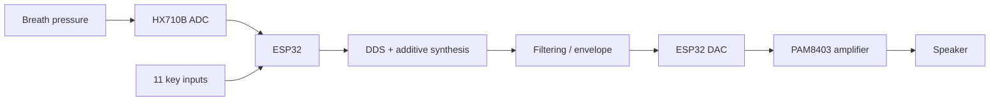

# Electronic Wind Instrument (EWI)

Final-year TU Dublin engineering project: a low-cost embedded electronic wind instrument built around an ESP32.

## Overview

The instrument converts breath pressure and key inputs into real-time audio. The final prototype integrates:

- ESP32 microcontroller
- HX710B 24-bit ADC + pressure sensor for breath input
- 6 main fingering keys + 5 modifier/control buttons
- Direct Digital Synthesis (DDS) with additive synthesis
- ESP32 internal 8-bit DAC
- PAM8403 Class-D amplifier and speaker
- Custom 3D-printed enclosure and moisture-management system

The project received an **A1**.

## System architecture

## Embedded software

The final firmware performs two main tasks at different rates:

- **Control path:** key scanning, button debouncing and breath sensing
- **Audio path:** continuous waveform generation at approximately **22.05 kHz**

Audio is generated with a phase accumulator and three harmonics:

- fundamental: 1.00
- second harmonic: 0.20
- third harmonic: 0.05

Breath pressure controls the output amplitude after calibration, thresholding and smoothing. Frequency changes are also smoothed to avoid abrupt transitions.

## Engineering challenges

Several practical issues were found during development:

- blocking pressure-sensor reads caused audible stuttering
- the HX710B introduced latency and slow pressure decay
- ESP32 DAC resolution introduced audible quantisation artefacts
- condensation could saturate the breath sensor

A custom airflow/moisture trap was designed to separate moisture from the pressure-sensing path. In testing, reliable continuous operation improved from approximately **10–15 minutes to more than 60 minutes**.

## Repository structure

- `src/final/FINALBreathButtonSound.ino` — final integrated firmware
- `src/development/11ButtonsNoBreath.ino` — button/fingering and audio development
- `src/development/workingBreathandSound.ino` — breath-control and audio development

The source files in this repository are the original project sketches retained from the 2026 project archive.

## Build notes

Target platform: **ESP32 / Arduino**

The final firmware uses the ESP32 internal DAC and direct GPIO reads. Pin assignments are defined at the top of the sketch.

## Key results

- real-time embedded audio generation
- 11 mapped inputs
- implemented note range approximately C3–C5 with modifiers
- responsive key control with no noticeable user-perceived delay
- stable audio under normal operation with minor artefacts
- >60 minutes continuous operation after moisture-management redesign

## Limitations

The pressure sensor remained the main limitation because of its relatively low update rate, drift and slow decay. An external higher-resolution audio DAC and a faster pressure sensor would be sensible next steps.
