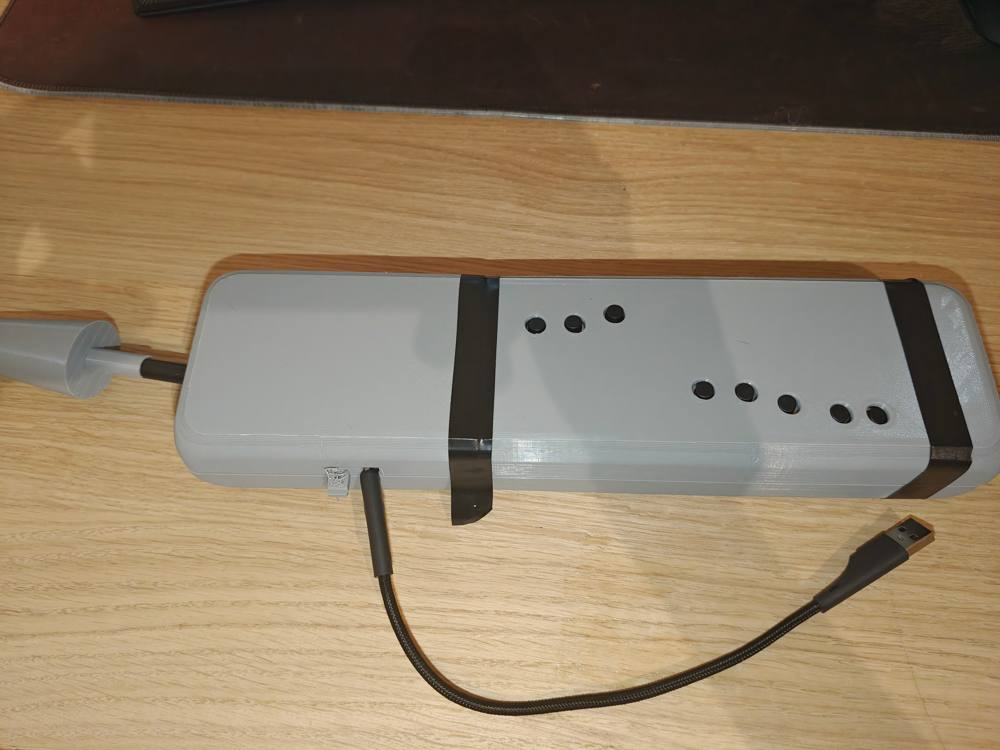
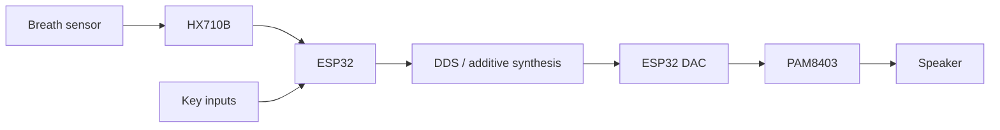
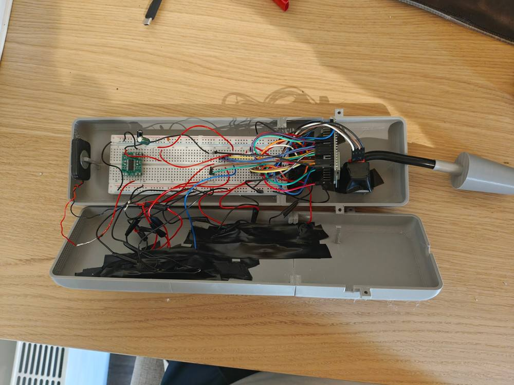
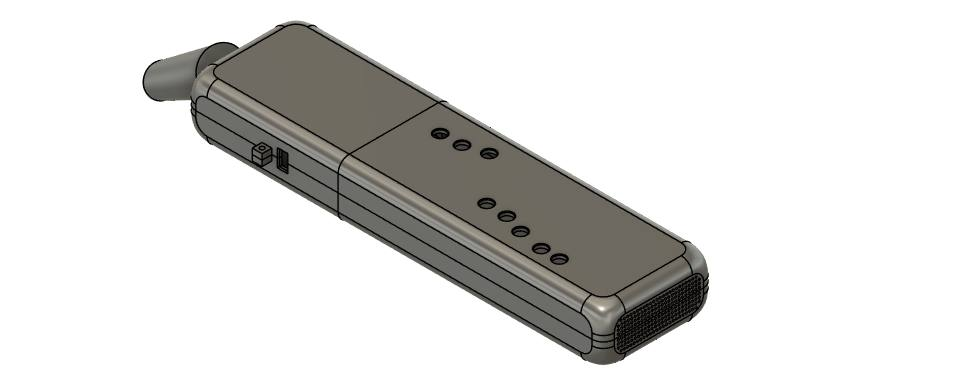
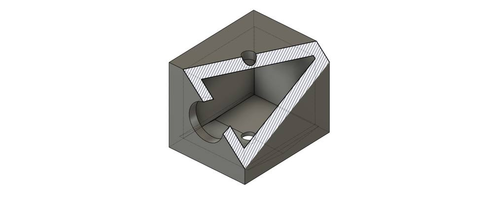

# Electronic Wind Instrument (EWI)

Final-year TU Dublin project built in the **Arduino IDE** using an ESP32.

## What it does

The instrument uses breath pressure and button inputs to control real-time audio. The final build used:

- ESP32
- HX710B 24-bit ADC and pressure sensor
- 6 main keys and 5 modifier/control buttons
- ESP32 internal DAC
- PAM8403 amplifier and speaker
- custom 3D-printed enclosure and moisture trap

The project received an **A1**.

## Hardware

| Inside the prototype | CAD model |
|---|---|
|  |  |

The original Fusion 360 files are in `hardware/3d/`:

- `Ewi_Enclosure.f3z`
- `ewi_mouthpiece.f3d`
- `Moisture_Trap_1.f3d`

## Firmware

The Arduino sketch handles key scanning, button debouncing, breath sensing and audio generation. Audio runs at about **22.05 kHz** using DDS with a fundamental plus second and third harmonics.

Breath pressure is calibrated and smoothed before being used to control amplitude. Frequency changes are also smoothed to reduce abrupt transitions.

## Development

The main issues I ran into were sensor latency, audio stuttering and moisture reaching the pressure sensor. Adding the moisture trap increased reliable running time from roughly **10–15 minutes to over 60 minutes**.

## Files

- `src/final/FINALBreathButtonSound.ino` — final Arduino sketch
- `src/development/11ButtonsNoBreath.ino` — button/fingering development
- `src/development/workingBreathandSound.ino` — breath-control development
- `hardware/3d/` — Fusion 360 files
- `docs/images/` — prototype and CAD images

Development environment: **Arduino IDE (ESP32)**
