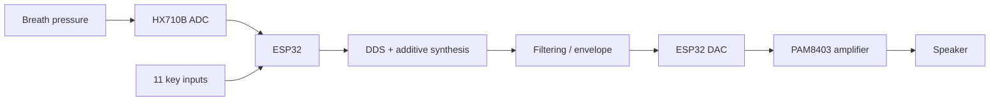

# Electronic Wind Instrument (EWI)

Final-year TU Dublin engineering project: a low-cost embedded electronic wind instrument built around an ESP32.

## Overview

The instrument converts breath pressure and key inputs into real-time audio. The final prototype integrates:

- ESP32 microcontroller
- HX710B 24-bit ADC + pressure sensor for breath input
- 6 main fingering keys + 5 modifier/control buttons
- Direct Digital Synthesis (DDS) with additive synthesis
- ESP32 internal 8-bit DAC
- PAM8403 Class-D amplifier and speaker
- Custom 3D-printed enclosure and moisture-management system

The project received an **A1**.

## System architecture

## Prototype and mechanical design

The enclosure and mouthpiece were modelled in Fusion 360 and 3D printed for the final prototype.

| Prototype interior | CAD enclosure |
|---|---|
|  |  |

A separate moisture-management insert was added after condensation repeatedly affected the pressure-sensing system.

Original CAD files are included under `hardware/3d/`:

- `Ewi_Enclosure.f3z` — Fusion 360 enclosure archive
- `ewi_mouthpiece.f3d` — mouthpiece model
- `Moisture_Trap_1.f3d` — moisture-management insert

## Embedded firmware

The final Arduino firmware performs two main tasks at different rates:

- **Control path:** key scanning, button debouncing and breath sensing
- **Audio path:** continuous waveform generation at approximately **22.05 kHz**

Audio is generated with a phase accumulator and three harmonics:

- fundamental: 1.00
- second harmonic: 0.20
- third harmonic: 0.05

Breath pressure controls the output amplitude after calibration, thresholding and smoothing. Frequency changes are also smoothed to avoid abrupt transitions.

## Engineering challenges

Several practical issues were found during development:

- blocking pressure-sensor reads caused audible stuttering
- the HX710B introduced latency and slow pressure decay
- ESP32 DAC resolution introduced audible quantisation artefacts
- condensation could saturate the breath sensor

A custom airflow/moisture trap was designed to separate moisture from the pressure-sensing path. In testing, reliable continuous operation improved from approximately **10–15 minutes to more than 60 minutes**.

## Repository structure

- `src/final/FINALBreathButtonSound.ino` — original final integrated firmware
- `src/development/11ButtonsNoBreath.ino` — original button/fingering and audio development sketch
- `src/development/workingBreathandSound.ino` — original breath-control and audio development sketch
- `hardware/3d/` — original Fusion 360 project files
- `docs/images/` — prototype and CAD images

The firmware and CAD files are the original project files retained from the 2026 project archive.

## Build notes

Development environment: **Arduino IDE (ESP32)**

The final firmware uses the ESP32 internal DAC and direct GPIO reads. Pin assignments are defined at the top of the sketch.

## Key results

- real-time embedded audio generation
- 11 mapped inputs
- implemented note range approximately C3–C5 with modifiers
- responsive key control with no noticeable user-perceived delay
- stable audio under normal operation with minor artefacts
- >60 minutes continuous operation after moisture-management redesign
